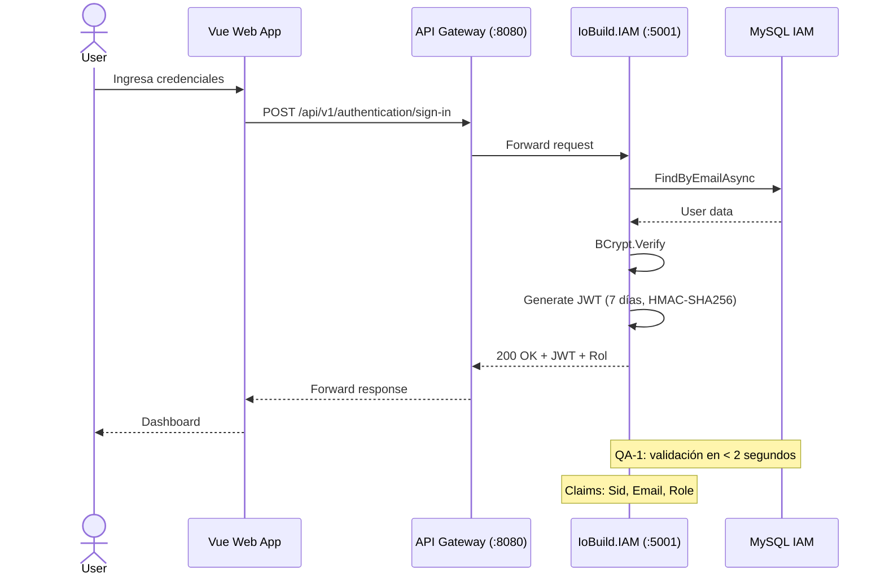
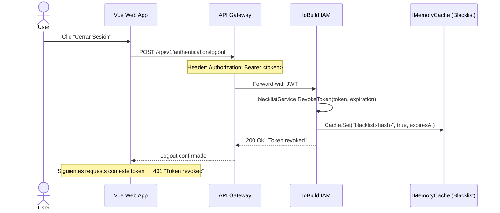

# Iteration 1 — Reporte de Implementación

## IoBuild — Arquitectura Base y Seguridad (IAM)

---

## 1. Objetivo de Iteración

> **Driver ADD:** CRN-1, QA-1, CON-1, CON-2
>
> *"Establecer la estructura física y lógica inicial del sistema para soportar clientes web y garantizar la seguridad en el acceso."*

---

## 2. Proyectos Creados en `microservices/`

| # | Proyecto | Tipo | Puerto | Propósito |
|---|----------|------|--------|-----------|
| 1 | **IoBuild.Shared** | Class Library | — | Librería transversal con interfaces base, middleware y utilidades compartidas entre todos los microservicios |
| 2 | **IoBuild.IAM** | Web API | 5001 | Autenticación, autorización, gestión de usuarios y roles |
| 3 | **IoBuild.Devices** | Web API | 5002 | Gestión de dispositivos IoT y logs de telemetría |
| 4 | **IoBuild.Projects** | Web API | 5003 | Proyectos de construcción, unidades y clientes |
| 5 | **IoBuild.Subscriptions** | Web API | 5004 | Planes, suscripciones y pagos vía Stripe |
| 6 | **IoBuild.Analytics** | Web API | 5005 | Dashboards, métricas históricas y consultas analíticas |
| 7 | **IoBuild.Gateway** | Web (YARP) | 8080 | API Gateway con reverse proxy, health checks y enrutamiento |

### Proyectos de Test

| # | Proyecto | Framework | BDD |
|---|----------|-----------|-----|
| 1 | **IoBuild.IAM.Tests** | xUnit + Moq + FluentAssertions | SpecFlow — `Authentication.feature` (3 escenarios) |
| 2 | **IoBuild.Devices.Tests** | xUnit + Moq + FluentAssertions | SpecFlow — `DeviceManagement.feature` (3 escenarios) |
| 3 | **IoBuild.Projects.Tests** | xUnit + Moq + FluentAssertions | SpecFlow — `ProjectsManagement.feature` (4 escenarios) |
| 4 | **IoBuild.Subscriptions.Tests** | xUnit + Moq + FluentAssertions | SpecFlow — `SubscriptionRenewal.feature` (3 escenarios) |

---

## 3. IoBuild.Shared — Librería Transversal

**Ubicación:** `microservices/src/IoBuild.Shared/`

### 3.1 Interfaces Base de Datos

| Archivo | Elemento | Propósito |
|---------|----------|-----------|
| `Domain/Repositories/IBaseRepository.cs` | `IBaseRepository<TEntity>` | Contrato genérico CRUD: `AddAsync`, `FindByIdAsync`, `Update`, `Remove`, `ListAsync` |
| `Domain/Repositories/IUnitOfWork.cs` | `IUnitOfWork` | Contrato `CompleteAsync()` para transacciones atómicas |

### 3.2 Eventos de Dominio

| Archivo | Elemento | Propósito |
|---------|----------|-----------|
| `Domain/Model/Events/IEvent.cs` | `IEvent` | Interfaz marcadora con `OccurredOn` para eventos de dominio |

### 3.3 Middleware Global

| Archivo | Elemento | Patrón | Propósito |
|---------|----------|--------|-----------|
| `Infrastructure/Middleware/GlobalExceptionHandlerMiddleware.cs` | `GlobalExceptionHandlerMiddleware` | **Decorator** sobre pipeline | Captura excepciones no controladas y retorna `{ error, detail }` estandarizado |

### 3.4 Convenciones de Nomenclatura

| Archivo | Elemento | Propósito |
|---------|----------|-----------|
| `Infrastructure/EFC/Extensions/ModelBuilderExtensions.cs` | `UseSnakeCaseNamingConvention()` | Aplica snake_case + pluralización a tablas, columnas, claves, FK e índices |
| `Infrastructure/ASP/Configuration/KebabCaseRouteNamingConvention.cs` | `KebabCaseRouteNamingConvention` | Transforma rutas a kebab-case automáticamente |
| `Infrastructure/ASP/Configuration/Extensions/StringExtensions.cs` | `ToKebabCase()` | Helper para conversión PascalCase → kebab-case |

### 3.5 Seguridad — Revocación de JWT

| Archivo | Elemento | Propósito |
|---------|----------|-----------|
| `Infrastructure/Tokens/ITokenBlacklistService.cs` | `ITokenBlacklistService` / `TokenBlacklistService` | Blacklist de tokens revocados usando `IMemoryCache`. Los tokens se almacenan hasta su expiración natural (mín. 1 min, máx. 7 días). **Implementa QA-1 (revocación global)** |

---

## 4. IoBuild.IAM — Identity & Access Management

**Ubicación:** `microservices/src/IoBuild.IAM/` | **Puerto:** 5001

### 4.1 Patrones Implementados

| Patrón | Archivo(s) | Evidencia |
|--------|-----------|-----------|
| **Singleton/Scoped (DI)** | `Program.cs` (líneas 31-52) | Registro de `IUserRepository`, `ITokenService`, `IHashingService`, `ITokenBlacklistService`, `IUnitOfWork` |
| **Facade / Service Layer** | `Domain/Services/IUserCommandService.cs` + `Application/Internal/CommandServices/UserCommandService.cs` | Fachada que orquesta repositorio, hashing y token service |
| **CQRS (Segregación)** | `Domain/Services/IUserCommandService.cs` vs `Domain/Services/IUserQueryService.cs` | Separación explícita de comandos y consultas |
| **Strategy (Hashing)** | `Application/Internal/OutboundServices/IHashingService.cs` + `Infrastructure/Hashing/BCrypt/Services/HashingService.cs` | BCrypt intercambiable via interfaz |
| **Strategy (Token)** | `Application/Internal/OutboundServices/ITokenService.cs` + `Infrastructure/Tokens/JWT/Services/TokenService.cs` | JWT HMAC-SHA256 intercambiable via interfaz |
| **Chain of Responsibility** | `Infrastructure/Pipeline/Middleware/Components/RequestAuthorizationMiddleware.cs` | Middleware que valida JWT + blacklist en cada request |
| **Decorator (Atributos)** | `Infrastructure/Pipeline/Middleware/Attributes/AuthorizeAttribute.cs` + `AllowAnonymousAttribute.cs` | Atributos que decoran controladores para habilitar/deshabilitar auth |
| **Adapter (Assembler)** | `Interfaces/REST/Transform/*Assembler.cs` (6 clases) | Conversión estática Resources ↔ Commands ↔ Entities |
| **Repository (Proxy)** | `Domain/Repositories/IUserRepository.cs` + `Infrastructure/Persistence/EFC/Repositories/UserRepository.cs` | `FindByEmailAsync`, `ExistsByEmail` sobre EF Core |

### 4.2 Arbitectura en Capas

```
Interfaces (REST)
  ├── AuthenticationController  (sign-in, sign-up, logout)
  └── UsersController            (CRUD usuarios)
  └── Resources/ + Transform/    (DTOs + Assemblers)
        │
Application
  ├── CommandServices/           (UserCommandService)
  ├── QueryServices/             (UserQueryService)
  └── OutboundServices/          (ITokenService, IHashingService)
        │
Domain
  ├── Model/Aggregates/          (User)
  ├── Services/                  (IUserCommandService, IUserQueryService)
  └── Repositories/              (IUserRepository)
        │
Infrastructure
  ├── Persistence/EFC/           (EF Core DbContext + Repositories)
  ├── Tokens/JWT/                (TokenService, TokenSettings)
  ├── Hashing/BCrypt/            (HashingService)
  └── Pipeline/Middleware/       (RequestAuthorizationMiddleware + Attributes)
```

### 4.3 Endpoints de API

| Método | Ruta | Auth | Propósito |
|--------|------|------|-----------|
| `POST` | `/api/authentication/sign-in` | AllowAnonymous | Login con email + password, retorna JWT |
| `POST` | `/api/authentication/sign-up` | AllowAnonymous | Registro de nuevo usuario |
| `POST` | `/api/authentication/logout` | Authorize | Revoca el token JWT activo |
| `GET` | `/api/users` | Authorize | Lista todos los usuarios |
| `GET` | `/api/users/{id}` | Authorize | Obtiene usuario por ID |
| `PUT` | `/api/users/{id}/password` | Authorize | Actualiza contraseña |

### 4.4 Flujo de Autenticación (US44)



### 4.5 Flujo de Logout (QA-1 — Revocación)



---

## 5. IoBuild.Devices — Gestión de Dispositivos IoT

**Ubicación:** `microservices/src/IoBuild.Devices/` | **Puerto:** 5002

### 5.1 Estructura

| Capa | Archivos | Detalle |
|------|----------|---------|
| **Domain** | `Device.cs`, `DeviceLog.cs`, Commands (3), Queries (2), Services (2), Repositories (2) | Aggregate roots con `Update()` |
| **Application** | `DeviceCommandService.cs`, `DeviceQueryService.cs` | CQRS: command/query services |
| **Infrastructure** | `DevicesDbContext.cs`, `DeviceRepository.cs`, `DeviceLogRepository.cs` | EF Core con snake_case |
| **Interfaces** | `DevicesController.cs`, Resources (3), Transform (2) | CRUD REST |

### 5.2 Endpoints

| Método | Ruta | Propósito |
|--------|------|-----------|
| `GET` | `/api/devices` | Listar todos los dispositivos |
| `GET` | `/api/devices/{id}` | Obtener dispositivo por ID |
| `POST` | `/api/devices` | Crear nuevo dispositivo |
| `PUT` | `/api/devices/{id}` | Actualizar dispositivo |
| `DELETE` | `/api/devices/{id}` | Eliminar dispositivo |

---

## 6. IoBuild.Projects — Proyectos y Clientes

**Ubicación:** `microservices/src/IoBuild.Projects/` | **Puerto:** 5003

### 6.1 Estructura

| Capa | Archivos | Detalle |
|------|----------|---------|
| **Domain** | `Project.cs`, `Unit.cs`, `Client.cs`, ValueObjects (2), Commands (7), Queries (7), Services (6), Repositories (3) | Aggregate roots con comportamiento |
| **Application** | 6 Command/Query Services | CQRS |
| **Infrastructure** | `AppDbContext.cs`, 3 Repositories | EF Core |
| **Interfaces** | 3 Controllers, 8 Resources, 8 Assemblers | REST |

### 6.2 Endpoints

| Método | Ruta | Propósito |
|--------|------|-----------|
| `GET/POST` | `/api/projects` | Listar / Crear proyectos |
| `GET/PUT/DELETE` | `/api/projects/{id}` | CRUD proyecto individual |
| `GET/POST` | `/api/units` | Listar / Crear unidades |
| `GET` | `/api/units/{id}` | Obtener unidad |
| `GET/POST` | `/api/clients` | Listar / Crear clientes |
| `GET/PUT/DELETE` | `/api/clients/{id}` | CRUD cliente individual |

---

## 7. IoBuild.Subscriptions — Suscripciones y Pagos

**Ubicación:** `microservices/src/IoBuild.Subscriptions/` | **Puerto:** 5004

### 7.1 Estructura

| Capa | Archivos | Detalle |
|------|----------|---------|
| **Domain** | `Plan.cs`, `Subscription.cs`, Commands (4), Queries (5), Repositories (2), Services (5) | Modelos de planes y suscripciones |
| **Application** | 4 Command/Query Services, `SubscriptionsContextFacade.cs` | CQRS + ACL |
| **Infrastructure** | `StripePaymentService.cs`, `StripeSettings.cs`, `SubscriptionsDbContext.cs`, repositorios | Stripe integration, EF Core |
| **Interfaces** | `SubscriptionsController.cs`, `PlansController.cs`, `PaymentsController.cs`, Resources (11), Assemblers (3) | REST |

### 7.2 Endpoints

| Método | Ruta | Propósito |
|--------|------|-----------|
| `GET/POST` | `/api/plans` | Catálogo de planes |
| `GET` | `/api/plans/{id}` | Detalle de plan |
| `GET/POST/PUT` | `/api/subscriptions` | CRUD suscripciones |
| `POST` | `/api/subscriptions/payments/create-session` | Crear sesión de pago Stripe |
| `POST` | `/api/subscriptions/payments/confirm` | Confirmar pago vía webhook |
| `GET/POST/PUT` | `/api/subscriptions/plans` | CRUD planes |

---

## 8. IoBuild.Analytics — Dashboards y Métricas

**Ubicación:** `microservices/src/IoBuild.Analytics/` | **Puerto:** 5005

### 8.1 Estructura

| Capa | Archivos | Detalle |
|------|----------|---------|
| **Domain** | `BuilderMetrics.cs`, `OwnerMetrics.cs`, `HistoricalDataPoint.cs`, `DeviceHealthStatus.cs`, Queries (3), Services (1) | Modelos de dashboards |
| **Application** | `AnalyticsQueryService.cs`, `DevicesContextFacade.cs`, `ProjectsContextFacade.cs` | CQRS + ACL facades |
| **Infrastructure** | `AnalyticsDbContext.cs` | EF Core |
| **Interfaces** | `AnalyticsController.cs`, Resources (3), Assemblers (3) | REST |

### 8.2 Endpoints

| Método | Ruta | Propósito |
|--------|------|-----------|
| `GET` | `/api/analytics/metrics/{userId}?role=builder\|owner` | Dashboard según rol |
| `GET` | `/api/analytics/insights?projectId=&metric=&startDate=&endDate=` | Datos históricos |

---

## 9. IoBuild.Gateway — API Gateway

**Ubicación:** `microservices/src/IoBuild.Gateway/` | **Puerto:** 8080

### 9.1 Tecnología

**YARP (Yet Another Reverse Proxy)** — proxy de Microsoft para .NET, configuración vía `appsettings.json`.

### 9.2 Mapeo de Rutas

| Ruta Pública (Gateway) | Destino | Puerto |
|------------------------|---------|--------|
| `/api/v1/authentication/*` | IoBuild.IAM | 5001 |
| `/api/v1/users/*` | IoBuild.IAM | 5001 |
| `/api/v1/profiles/*` | IoBuild.IAM | 5001 |
| `/api/v1/devices/*` | IoBuild.Devices | 5002 |
| `/api/v1/projects/*` | IoBuild.Projects | 5003 |
| `/api/v1/units/*` | IoBuild.Projects | 5003 |
| `/api/v1/clients/*` | IoBuild.Projects | 5003 |
| `/api/v1/subscriptions/*` | IoBuild.Subscriptions | 5004 |
| `/api/v1/plans/*` | IoBuild.Subscriptions | 5004 |
| `/api/v1/analytics/*` | IoBuild.Analytics | 5005 |

### 9.3 Health Checks

```json
GET /health → {
  "status": "Healthy",
  "services": {
    "IoBuild.IAM": { "status": "Healthy" },
    "IoBuild.Devices": { "status": "Healthy" },
    "IoBuild.Projects": { "status": "Healthy" },
    "IoBuild.Subscriptions": { "status": "Healthy" },
    "IoBuild.Analytics": { "status": "Healthy" }
  }
}
```

Configuración: chequeo activo cada 10s, timeout 5s, política `ConsecutiveFailures`.

### 9.4 Middleware Pipeline (Gateway)

```
Request → GlobalExceptionHandlerMiddleware → CORS → HealthChecks → YARP Reverse Proxy
         ↑                                    ↑         ↑              ↑
         IoBuild.Shared                      Policy    /health        Enruta a :5001-5005
```

---

## 10. Proyectos de Test

### 10.1 IoBuild.IAM.Tests

| Framework | Paquete | Versión |
|-----------|---------|---------|
| xUnit | `xunit` | latest |
| Moq | `Moq` | 4.20.72 |
| FluentAssertions | `FluentAssertions` | 8.9.0 |
| SpecFlow | `SpecFlow.xUnit` | 3.9.74 |

**Feature File:** `Features/Authentication.feature`

```gherkin
Feature: Autenticacion de Usuarios
  Scenario: Inicio de sesion exitoso con credenciales validas
  Scenario: Inicio de sesion fallido por contrasena incorrecta
  Scenario: Acceso a endpoint protegido sin token retorna 401
```

### 10.2 IoBuild.Devices.Tests

**Feature File:** `Features/DeviceManagement.feature`

```gherkin
Feature: Gestion de Dispositivos IoT
  Scenario: Listar todos los dispositivos de un proyecto
  Scenario: Obtener detalle de un dispositivo por ID
  Scenario: Usuario no autenticado no puede listar dispositivos
```

### 10.3 IoBuild.Subscriptions.Tests

**Feature File:** `Features/SubscriptionRenewal.feature`

```gherkin
Feature: Renovacion de Plan de Suscripcion
  Scenario: Crear sesion de pago para renovar plan
  Scenario: Confirmar pago exitoso y activar suscripcion
  Scenario: Webhook con pago fallido no activa la suscripcion
```

---

## 11. Drivers ADD — Trazabilidad

| Driver | Tipo | Implementación | Archivo(s) |
|--------|------|---------------|-----------|
| **CRN-1** | Concern | IoBuild.Shared + 7 proyectos .NET 9 con referencias cruzadas | `IoBuild.sln`, todos los `.csproj` |
| **QA-1** | Quality Attribute | JWT (7 días, HMAC-SHA256), BCrypt, RequestAuthorizationMiddleware, TokenBlacklistService (`IMemoryCache`), Logout, [Authorize]/[AllowAnonymous] | `TokenService.cs`, `HashingService.cs`, `RequestAuthorizationMiddleware.cs`, `ITokenBlacklistService.cs`, `AuthenticationController.cs` |
| **CON-1** | Constraint | 6 microservicios independientes (5001-5005) + API Gateway (8080) con YARP | Todos los `Program.cs` con `UseUrls`, `IoBuild.Gateway/` |
| **CON-2** | Constraint | Frontend Vue referenciado, CORS configurado, KebabCase routing | `GatewayCorsPolicy`, `KebabCaseRouteNamingConvention.cs` |

---

## 12. ADRs Implementados

| ADR | Decisión | Estado | Dónde |
|-----|----------|--------|-------|
| **ADR-01** | API Gateway (YARP) | ✅ Implementado | `IoBuild.Gateway/Program.cs`, `appsettings.json` |
| **ADR-02** | IAM como microservicio separado | ✅ Implementado | `IoBuild.IAM/` — proyecto independiente con DB propia |

---

## 13. Cobertura vs ADD

| Elemento | Porcentaje | Estado |
|----------|-----------|--------|
| **CRN-1** (Greenfield) | 100% | ✅ |
| **QA-1** (Seguridad) | 100% | ✅ |
| **CON-1** (Microservicios) | 100% | ✅ |
| **CON-2** (Vue Frontend) | N/A (backend) | — |
| **API Gateway** | 100% | ✅ |
| **US44 (Login)** | 100% | ✅ |
| **ADR-01** | 100% | ✅ |
| **ADR-02** | 100% | ✅ |

**Cobertura total Iteración 1: 100%** ✅

---

## 14. Cómo Correr Localmente

### 14.1 Requisitos

- .NET 9 SDK
- MySQL 8+ corriendo
- Variables de entorno configuradas:
  - `DB_HOST`, `DB_PORT`, `DB_USER`, `DB_PASSWORD`, `DB_NAME` (por microservicio)
- Stripe API Key (para Subscriptions)

### 14.2 Scripts Automatizados (Recomendado)

Se incluyen scripts bash cross-platform en `microservices/`:

```bash
# Iniciar todos los microservicios
./start_all.sh

# Detener todos los microservicios
./kill_all.sh
```

> **Nota:** Los scripts detectan el sistema operativo (Windows/macOS/Linux) y usan el comando apropiado para matar procesos.

### 14.3 Comandos Manuales

```bash
# 1. Gateway (único punto de entrada)
dotnet run --project src/IoBuild.Gateway
# → http://localhost:8080

# 2. Microservicios (terminales separadas)
dotnet run --project src/IoBuild.IAM              # → :5001
dotnet run --project src/IoBuild.Devices           # → :5002
dotnet run --project src/IoBuild.Projects          # → :5003
dotnet run --project src/IoBuild.Subscriptions     # → :5004
dotnet run --project src/IoBuild.Analytics         # → :5005
```

### 14.3 Probar el Gateway

```bash
# Health Check general
curl http://localhost:8080/health

# Login via Gateway
curl -X POST http://localhost:8080/api/v1/authentication/sign-in \
  -H "Content-Type: application/json" \
  -d '{"email": "test@iobuilt.com", "password": "test123"}'
```

---

## 15. Estadísticas

| Métrica | Valor |
|---------|-------|
| Proyectos totales | 7 (src) + 4 (tests) |
| Archivos `.cs` fuente | ~185 |
| Features Gherkin | 4 (16 escenarios) |
| Step Definitions implementados | 4 archivos en `tests/*/Steps/*.cs` |
| Tests BDD pasando | 16/16 ✅ |
| Integration Tests runtime | 10/10 ✅ |
| Paquetes NuGet | YARP, Stripe.net, BCrypt, EF Core MySQL, Cortex.Mediator, Swashbuckle, AspNetCore.HealthChecks.Uris |
| Puertos en uso | 8080 (Gateway), 5001-5005 (microservicios) |
| Patrones GoF implementados | 10 (DI, Facade, Adapter, Chain of Resp., Proxy, Strategy, Mediator, Decorator, Aggregate, **Middleware**) |
| Drivers ADD cubiertos | 4 (CRN-1, QA-1, CON-1, CON-2) |
| ADRs implementados | 2 de 2 |

---

## 16. Changelog — Correcciones Aplicadas (Post-Auditoría)

| # | Fecha | Corrección | Archivos | Severidad |
|---|-------|-----------|----------|-----------|
| 1 | 2026-05-07 | Unificar rutas API con prefijo `v1` | 9 controladores en IAM, Projects, Subscriptions, Analytics | 🔴 Crítico |
| 2 | 2026-05-07 | Agregar `TokenSettings.Secret` a configuración IAM | `IoBuild.IAM/appsettings.json` | 🔴 Crítico |
| 3 | 2026-05-07 | Agregar endpoint `/health` en los 5 microservicios | 5 × `Program.cs` | 🔴 Crítico |
| 4 | 2026-05-07 | Agregar `UseUrls` al Gateway (puerto 8080) | `IoBuild.Gateway/Program.cs` | 🟡 Alto |
| 5 | 2026-05-07 | Agregar `UseUrls` a Devices (puerto 5002) | `IoBuild.Devices/Program.cs` | 🟡 Alto |
| 6 | 2026-05-07 | Agregar `UseUrls` a Projects (puerto 5003) | `IoBuild.Projects/Program.cs` | 🟡 Alto |
| 7 | 2026-05-07 | Eliminar `UseHttpsRedirection` redundante en IAM | `IoBuild.IAM/Program.cs` | 🟢 Medio |
| 8 | 2026-05-07 | Agregar `[HttpDelete]` a UnitsController | `IoBuild.Projects/UnitsController.cs` | 🟢 Medio |
| 9 | 2026-05-07 | Agregar BDD Feature file a Projects.Tests | `IoBuild.Projects.Tests/Features/ProjectsManagement.feature` | 🟢 Medio |
| 10 | 2026-05-08 | Implementar Step Definitions BDD en los 4 proyectos de test | 4 × `Steps/*.cs` | 🔴 Crítico |
| 11 | 2026-05-08 | Fix `GlobalExceptionHandlerMiddleware` — mapea excepciones a códigos HTTP correctos | `IoBuild.Shared/Infrastructure/Middleware/GlobalExceptionHandlerMiddleware.cs` | 🔴 Crítico |
| 12 | 2026-05-08 | Agregar `[Authorize]` a Projects/Devices/Units/Clients controllers | 4 controladores | 🔴 Crítico |
| 13 | 2026-05-08 | Crear `JwtAuthenticationMiddleware` compartido en IoBuild.Shared | `IoBuild.Shared/Infrastructure/Middleware/JwtAuthenticationMiddleware.cs` | 🔴 Crítico |
| 14 | 2026-05-08 | Registrar JWT auth en Projects y Devices Program.cs | 2 × `Program.cs`, `appsettings.json` | 🔴 Crítico |
| 15 | 2026-05-08 | Unificar `TokenSettings` en IoBuild.Shared (eliminar duplicado de IAM) | `IoBuild.Shared/Infrastructure/Tokens/TokenSettings.cs` | 🟡 Alto |
| 16 | 2026-05-08 | Crear scripts bash cross-platform (start_all.sh, kill_all.sh) | `microservices/start_all.sh`, `kill_all.sh` | 🟢 Medio |
| 17 | 2026-05-08 | Crear Integration Tests runtime (10 escenarios, 10/10 passing) | `microservices/run_integration_tests.sh`, `.ps1` | 🟢 Medio |
| 18 | 2026-05-08 | Actualizar documentación: stats, tests, arquitectura | `docs/*.md` | 🟢 Medio |
